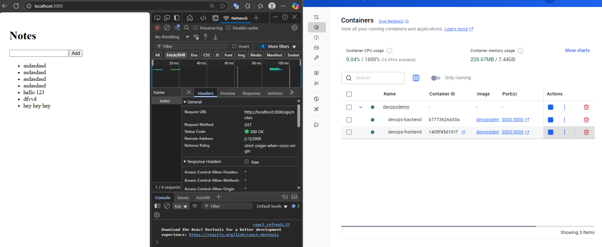
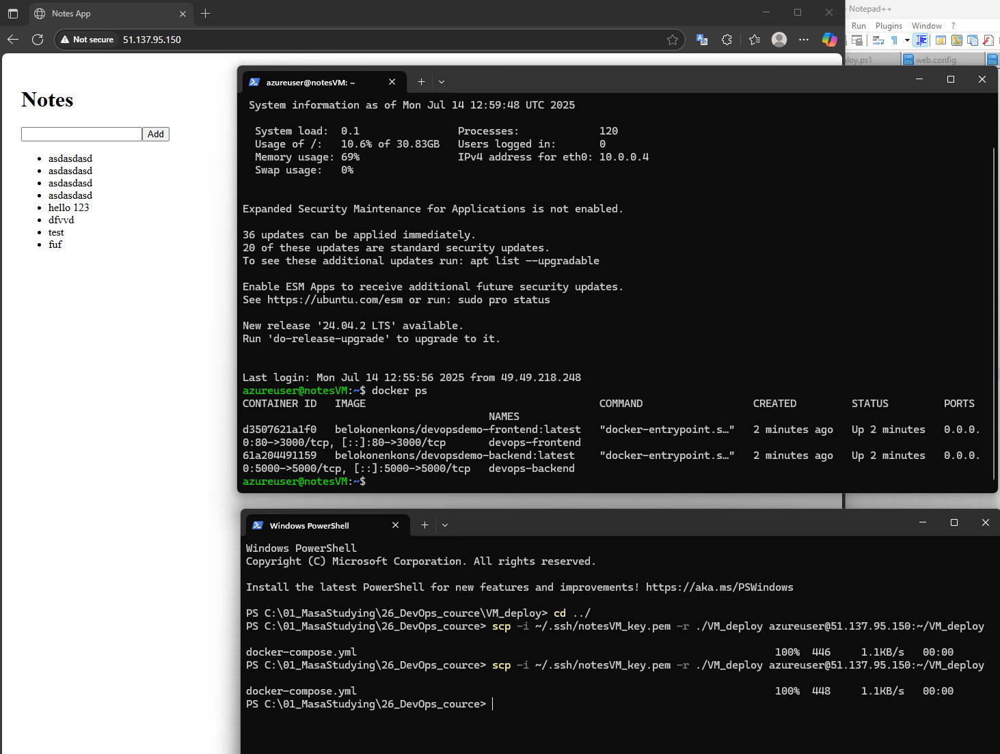
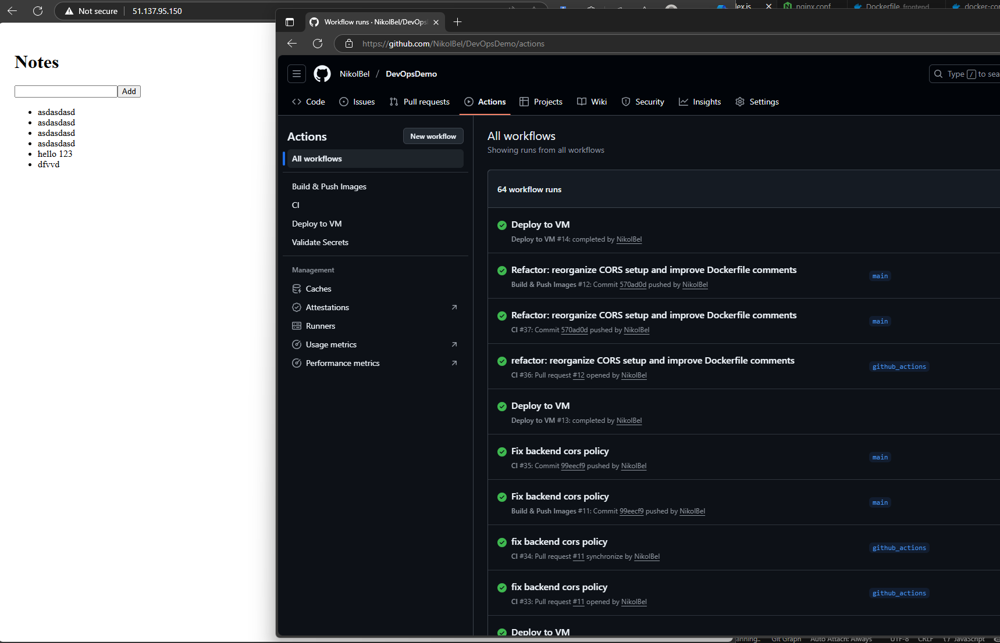

# DevOpsDemo project

This is a playground project consisting of a frontend (React) and a backend (Node.js/Express) apps for deployment training.

---
## Exercise 1. Docker locally​


### 🔧 Build and run 
```bash
cd ./
npm docker-compose up --build
```


## Exercise 2. Docker Azure VM


### 🔧 Deployment
Connect to VM
```bash
ssh -i ~/.ssh/notesVM_key.pem azureuser@51.137.95.150
```
Copy docker-compose file to remote VM:
```bash
scp -i ~/.ssh/notesVM_key.pem -r ./VM_deploy azureuser@51.137.95.150:~/VM_deploy
```

On the VM, pull both images:
```bash
docker pull belokonenkons/devopsdemo-backend:latest
docker pull belokonenkons/devopsdemo-frontend:latest

docker compose up -d
```


## Exercise 3. Automate deployment to VM with GitHub actions

- CI: Lints, tests (backend & frontend) and optionally validates Docker builds on PRs and pushes to main (excluding docs/compose changes).
- Build & Push Images: Builds multi-arch backend/frontend runtime images with semantic, latest, and short SHA tags and pushes them to Docker Hub (on main or version tags / reusable via workflow_call).
- Deploy to VM: On manual trigger or after a successful image build, copies compose + scripts to the VM, pulls specified image tags, recreates services, performs a basic health check, and prunes old images.
- Validate Secrets: Manually verifies required secrets and SSH access by attempting a masked connection to the target VM and reporting connectivity details.

--------------------------------------


## 📦 Debug Localy

### ▶️ Frontend
```bash
cd frontend
npm install
npm start
```
### ▶️ Backend
```bash
cd backend
npm install
node index.js
```